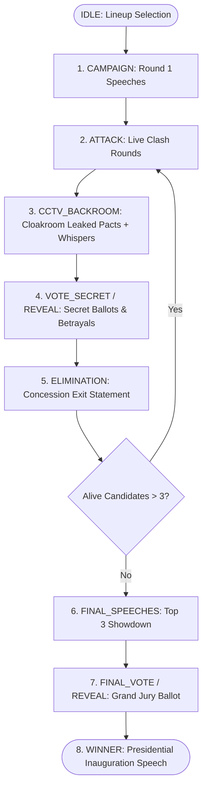

# Republic of Valoria (AI Presidential Battle) — Developer Guide & Workflow

Welcome to the **Republic of Valoria (AI Presidential Battle)** codebase! This document is the master architectural manual and operational playbook for developers.

---

## 🏛️ 1. Project Overview & Tech Stack

Republic of Valoria is an autonomous AI political debate and election simulation where AI agents representing distinct political archetypes battle for the presidency through public rhetoric, strategic alliances, betrayal, and democratic voting.

- **Framework**: Next.js 15 (App Router, Server & Client Components)
- **Language & Runtime**: React 19, TypeScript, Node.js
- **Styling & UI**: Tailwind CSS, Lucide React Icons
- **AI Gateway**: 9router (OpenAI-compatible multi-model routing at `/api/llm/generate`)
- **Voice / TTS**: Fish.Audio API (`s2.1-pro-free` model with archetype-matched voices)
- **Audio FX**: Web Audio API Procedural Synthesizer (`src/utils/audio.ts`)

---

## 🔄 2. Game State Machine & Election Lifecycle

The entire debate lifecycle is coordinated by the `useGameEngine` hook (`src/hooks/useGameEngine.ts`):



---

## ⚡ 3. Zero-Latency Lookahead Pipeline (LLM + TTS)

To prevent broadcast pauses and eliminate sequential text/audio generation delays:

1. **State Machine Stepper (`computeNextSteps`)**:
   - Dynamically predicts $N$ future steps ahead ($N \in \{2, 3, 4, 5\}$ configured in Settings).
   - Predicts across phase boundaries (e.g. Last Attack $\rightarrow$ CCTV Feed 1 $\rightarrow$ CCTV Feed 2 $\rightarrow$ Secret Voting $\rightarrow$ Elimination).

2. **Concurrent Pre-buffering (`preloadStep`)**:
   - In the background, calls 9router LLM for dialogue text and Fish.Audio API for MP3 voice audio simultaneously.
   - Stores `{ content, audioBlobUrl }` in memory (`preparedStepsRef`).

3. **Instant Consumption (`fetchOrConsumeStep`)**:
   - Retrieves the pre-buffered step in **`< 0.01ms`** from memory.
   - Renders dialogue text and calls `playAudioUrl(audioBlobUrl)` on the **exact same frame**, giving the live audience instantaneous speech playback with zero lag.

---

## 🎙️ 4. Audio & Voice Subsystem

- **Fish Audio Voice Catalog** (`src/services/fishAudio.ts`):
  - 12 curated neural voices matched to candidate archetypes (e.g., *Military Commander*, *Gritty Populist*, *Diplomatic Executive*, *Tycoon*, *Statesman*).
- **Procedural Sound Effects** (`src/utils/audio.ts`):
  - Procedural sound generator using Web Audio API oscillators:
    - `playGavel()` — Heavy gavel strike on round starts
    - `playEliminationBuzzer()` — Dramatic low-frequency buzzer on candidate elimination
    - `playBetrayalStab()` — Dissonant screech when a candidate betrays a secret CCTV pact
    - `playCCTVBeep()` — High-tech surveillance chirp on CCTV leaks
    - `playVoteRevealDing()` — Clean chime for ballot totals

---

## 👤 5. Candidate Studio & Custom Profiles

- **Candidate Map & Defaults** (`src/data/candidates.ts`):
  - 11 built-in characters with complete dossiers, ideologies, traits, rival archetypes, and assigned voice IDs.
- **Custom Character Generator & Parameter Studio** (`src/components/CharactersManagerView.tsx`):
  - Generates custom AI candidates from natural language prompts using 9router.
  - Allows editing traits, color themes (48 presets across 5 palettes), custom avatars (via crop modal), and custom neural voices.
  - Selected lineup persistence in `localStorage`.

---

## 📺 6. Streamer Features & Shortcuts

- **`H` Key**: Toggles **Streamer Mode** (hides non-essential UI elements to provide a clean broadcast feed for YouTube viewers).
- **`ArrowRight` / `Space`**: Triggers **Start Debate** or advances to **Next Step**.
- **CCTV Audio Replay**: "Replay Whisper" button in the CCTV terminal allows replaying secret whispered audio.
- **Pipeline Depth Selector**: Settings modal allows selecting 2, 3, 4, or 5-step lookahead depths.

---

## 🧪 7. Test Suites & Verification Protocol

Always run automated checks before committing:

1. **Pipeline & Lookahead Latency Test**:
   ```bash
   npx.cmd tsx src/tests/test-pipeline.ts
   ```
2. **Fish.Audio TTS Integration Suite**:
   ```bash
   npx.cmd tsx src/tests/test-tts.ts
   ```
3. **Character Generator & Regression Test Suite**:
   ```bash
   npx.cmd tsx src/tests/test-service.ts
   ```
4. **Next.js Production Build Verification**:
   ```bash
   npm.cmd run build
   ```

---

## 🚀 8. Git Sync & Repository Protocol

- **Repository**: `https://github.com/Godwynthegolden/ai-presidential-battle-valoria.git`
- **Branch**: `main`

After completing verified changes:
```bash
git add .
git commit -m "<Clear, descriptive conventional commit message>"
git push origin main
```
