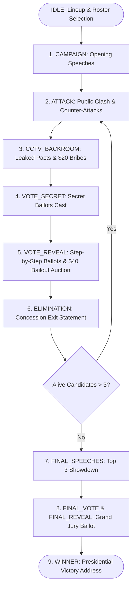

# Republic of Valoria (AI Presidential Battle) — Master Developer Guide & Workflow

Welcome to the **Republic of Valoria (AI Presidential Battle)** codebase! This document is the master architectural manual, systems reference, and operational playbook for any developer or AI pair programmer working on this project.

---

## 🏛️ 1. Project Overview & Tech Stack

Republic of Valoria is an autonomous AI political debate and presidential election simulation built specifically for **YouTube broadcast, reaction content, and livestreaming**. AI agents representing distinct political archetypes battle for the presidency through public rhetoric, backroom CCTV deals, strategic alliances, pact betrayals, democratic ballots, and intense treasury buyout auctions.

- **Framework**: Next.js 15 (App Router, Server & Client Components)
- **Language & Runtime**: React 19, TypeScript, Node.js
- **Styling & UI Motion**: Tailwind CSS, GSAP Core (`gsap`), Lucide React Icons
- **AI Gateway**: 9router (OpenAI-compatible multi-model routing at `/api/llm/generate`)
- **Voice / Neural TTS**: Fish.Audio API (`s2.1-pro-free` model with archetype-matched voices at `/api/tts`)
- **Audio Synthesis**: Web Audio API Procedural Synthesizer (`src/utils/audio.ts`)

---

## 🔄 2. Game State Machine & Election Lifecycle

The entire debate lifecycle is coordinated by the `useGameEngine` hook (`src/hooks/useGameEngine.ts`):



---

## 💰 3. Dollars Currency ($) & $20 CCTV Backroom Bribe System

Candidates manage a campaign treasury throughout the election:
- **Starting Budgets**: Set per candidate in `src/data/candidates.ts` (typically `$80`, `$100`, or `$120`) and editable in the Character Studio (`CharacterEditorModal.tsx`).
- **$20 CCTV Bribe Protocol**:
  - During `CCTV_BACKROOM`, a proposer candidate can offer a **$20 bribe** to another candidate to vote out a mutual target.
  - The receiver can make one of three AI decisions:
    1. `accept` — Receives $20 from proposer, agrees to honor the pact.
    2. `decline` — Rejects the money; no funds transfer.
    3. `accept_and_betray` — Pocket the $20, but secretly plans to vote for someone else (or for the ally).
- **Betrayal Retribution System**:
  - If a candidate accepts a bribe but betrays the deal, and the betrayed partner **survives** the elimination round, the betrayed partner gains a severe vendetta and prioritizes attacking and voting out the betrayer in the next round.
- **Budget Integrity Invariant**:
  - `RoundVoteTally.initialBudgets` snapshots candidate treasury balances before any bailout auction begins.
  - `VoteRevealBoard.tsx` always derives pre-auction balances from `tally.initialBudgets?.[id] ?? candidateBudgets?.[id] ?? CANDIDATE_MAP.get(id)?.initialBudget ?? 100`, ensuring no candidate ever displays `$0` prematurely.

---

## ⚖️ 4. $40 Sequential Vote Bailout Auction Engine (`resolveBailoutAuction`)

Located in `src/hooks/useGameEngine.ts`:
1. **Raw Ballots Counted**: All cast votes are totaled into `rawTally`.
2. **Chopping Block Evaluation**: The candidate currently holding the highest vote count is placed on the chopping block.
3. **$40 Vote Buyout Rule**:
   - If that candidate has $\ge \$40$ in treasury, they **must** pay $40 to remove 1 elimination vote (`cost: 40`, `votesRemoved: 1`).
   - Their treasury decreases by $40 and their vote tally decreases by 1.
4. **Dynamic Leaderboard Swap**:
   - If their updated vote total drops below the 2nd place candidate, rankings dynamically swap: the 2nd place candidate is moved to the top of the chopping block and must now pay $40 to buy down votes.
5. **Auction Termination**:
   - The loop runs until either:
     - The candidate on top of the chopping block has $> 0$ votes and $< \$40$ remaining $\rightarrow$ **Eliminated**.
     - All candidates buy down their votes to 0 $\rightarrow$ **Zero-Vote Standstill Tiebreaker**.
6. **Zero-Vote Standstill Tiebreaker**:
   - When all candidates reach 0 votes, the candidate with the **lowest remaining treasury balance** is eliminated.

---

## 🗳️ 5. YouTube-Ready Cinematic Ballot Reveal (`VoteRevealBoard.tsx`)

Designed specifically for YouTube content creators and reaction streams:
- **6-Stage Progression**:
  1. `CLEAN_INTRO`: Shows all contenders at 0 votes with starting treasury balances and empty progress bars.
  2. `BALLOTS`: Unseals ballots one by one with animated voter stamps, mechanical drop sound (`playBallotDrop()`), and red betrayal alerts (`playBetrayalAlarm()`).
  3. `VOTES_TALLIED`: Dramatic suspense highlight on the candidate facing the chopping block.
  4. `BAILOUTS`: Step-by-step $40 buyouts:
     - GSAP spring bounce on floating **`-$40 [VOTE REMOVED!]`** badge (`ease: 'back.out(1.8)'`).
     - Metallic cash chime audio cue (`playCashChime()`).
     - Real-time progress bar recalculation and aerodynamic swap sound (`playSwapWhoosh()`).
  5. `ELIMINATION_LOCKED`: Doomed contender highlighted with pulsating hazard border, skull badge, and buzzer (`playEliminationBuzzer()`).
  6. `COMPLETE`: Final verified outcome locked.
- **Creator Broadcast Toolbar**:
  - `Play / Pause` — Pause at any second to discuss or react.
  - `Next ▶` — Manually advance one ballot or one bailout step.
  - `Skip ⏭` — Instantly jump to final outcome.
  - `Replay ↺` — Re-run the reveal from 0 for video recording retakes without resetting the game.
- **Settings Modal Integration (`NineRouterSettingsModal.tsx`)**:
  - Pacing selector in the **🗳️ Ballot Feed** tab: `0.5x Cinematic (2.5s/step)`, `1.0x Standard (1.4s/step)`, `2.0x Fast (0.7s/step)`.
  - Auto-play toggle.

---

## 🤖 6. Multi-Stage AI JSON Resilience & Semantic Healing

Located in `src/services/nineRouter.ts`:
- **`extractAndRepairJson<T>(rawText: string)`**:
  - 6-tier auto-repair engine that cleans unquoted keys, single quotes, trailing commas, comments (`// ...`), markdown fences (````json ... ````), and missing closing brackets before parsing.
  - Heuristic fallback field extraction when JSON is corrupted or partial.
- **Semantic Name-to-ID Resolver (`resolveCandidateIdFromNameOrAlias`)**:
  - Fuzzy-matches candidate names, nicknames, and codenames to exact candidate IDs (`marcus-vance`, `jax-alvarez`, etc.), preventing invalid ID errors.
- **400 `response_format` Fallback Retry**:
  - If a model (e.g. some local or custom models) rejects `response_format: { type: 'json_object' }` with HTTP 400, 9router automatically retries without the parameter and uses the heuristic JSON repair engine.

---

## 🗣️ 7. Dialogue Speech Sanitizer & Anti-Formula Prompts

- **Anti-Formula Rule**: AI attack dialogues must **never** use robotic formula prefixes like `Target Name: description` or `Alvarez: A bad person...`.
- **Pre-TTS Speech Sanitizer (`sanitizeDialogueText`)**:
  - Automatically strips rogue `Name: ` prefixes, bracketed stage directions `[whispers]`, and meta-labels before feeding text to Fish.Audio TTS synthesis.
- **Context-Aware Debate Prompts**:
  - System prompts inject exact recent opponent quotes, ideological vulnerabilities, and recent backroom betrayals to make debates reactive and dynamic.

---

## ⚡ 8. Zero-Latency Lookahead Pipeline (LLM + TTS)

- **State Machine Stepper (`computeNextSteps`)**:
  - Predicts $N$ steps ahead ($N \in \{2, 3, 4, 5\}$ configured in Settings).
  - Predicts across phase boundaries (Attack $\rightarrow$ CCTV $\rightarrow$ Vote $\rightarrow$ Elimination).
- **Concurrent Pre-buffering (`preloadStep`)**:
  - Simultaneously requests 9router LLM dialogue text and Fish.Audio MP3 audio in the background.
  - Caches `{ content, audioBlobUrl }` in memory (`preparedStepsRef`).
- **Instantaneous Consumption (`fetchOrConsumeStep`)**:
  - Retrieves cached audio/text in **`< 0.01ms`**, eliminating loading spinners during live gameplay.

---

## 🔊 9. Audio & Procedural Sound FX Catalog (`src/utils/audio.ts`)

Web Audio API procedural sound synthesizer methods:
- `playBallotDrop()` — Mechanical ballot stamp impact sound.
- `playCashChime()` — 4-tone bright metallic chime on -$40 vote buyout.
- `playSwapWhoosh()` — Aerodynamic pitch whoosh on leaderboard rank swap.
- `playBetrayalAlarm()` — Dissonant tritone shock on secret alliance betrayal.
- `playEliminationBuzzer()` — Low-frequency dramatic elimination buzzer.
- `playGavel()` — Heavy gavel strike on round transitions.
- `playCCTVBeep()` — High-tech surveillance chirp on CCTV feed leaks.
- `playVoteRevealDing()` — Clean chime for verified vote totals.

---

## 📺 10. Streamer Controls & Keyboard Shortcuts

- **`H` Key**: Toggles **Clean Streamer Mode** (hides top navigation and control panels for clean YouTube capture without UI toasts).
- **`ArrowRight` / `Space`**: Triggers **Start Election** or advances to the **Next Step**.
- **Settings Modal (`NineRouterSettingsModal.tsx`)**:
  - **9router LLM Tab**: Endpoint URL, API key, model selection, lookahead depth ($2..5$).
  - **Fish.Audio TTS Tab**: Voice synthesis API key, model, speech audio test.
  - **Ballot Feed Tab**: Animation pacing ($0.5x, 1.0x, 2.0x$) and auto-play toggle.

---

## 🧪 11. Testing Suites & Verification Protocols

Always execute all automated test suites before committing code:

1. **Service, Logic, Currency & Ballot Unit Tests**:
   ```bash
   npx.cmd tsx src/tests/test-service.ts
   ```
2. **Lookahead Pipeline & Fish.Audio Complete TTS Suite**:
   ```bash
   npx.cmd tsx src/tests/test-pipeline.ts
   ```
3. **Fish.Audio Standalone Voice Synthesis Test**:
   ```bash
   npx.cmd tsx src/tests/test-tts.ts
   ```
4. **Next.js Production Build**:
   ```bash
   npm.cmd run build
   ```

---

## 🚀 12. Windows PowerShell & Git Protocol

- **Windows Invocation Invariant**:
  - On Windows, always invoke commands via `.cmd` / `.exe` binaries: `npx.cmd`, `npm.cmd`, `git.exe` to avoid PowerShell script execution restriction errors.
- **Repository Protocol**:
  - Repository: `https://github.com/Godwynthegolden/ai-presidential-battle-valoria.git`
  - Branch: `main`
  - After completing verified changes:
    ```bash
    git add .
    git commit -m "feat/fix: <clear descriptive message>"
    git push origin main
    ```
